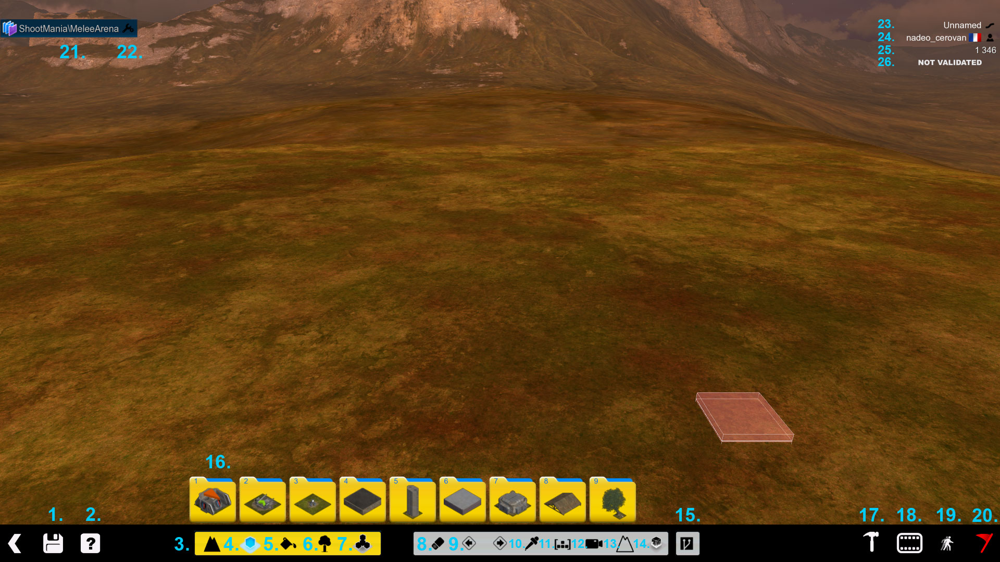
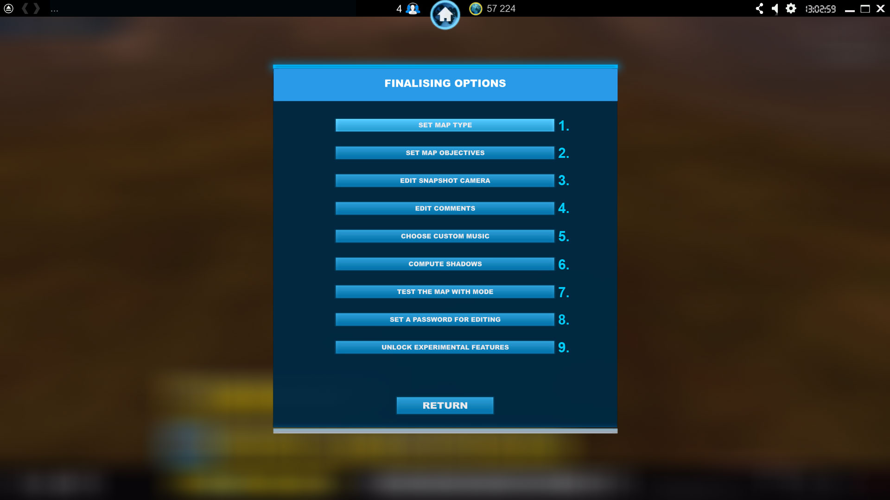

[TOC]

The map editor is one of the famous features of the Trackmania (and now Maniaplanet) game series. It gives you the possibility to create maps for the game very easily thanks to the block system.

This article will quickly explain you the interface and few building tricks.

If you want to check out all the shortcuts of the editor, please go [on this article][1].

# Interface

## Default interface

1. Save the map
2. Help about the map editor
3. Terraformation mode to change the landscape
4. Block mode: list all the blocks of the environment
5. Paint mode: used to change the image on panes and others blocks like them
6. Item mode: List all the items available in the [title pack][3] and/or in the folder `Documents\Maniaplanet\Items`
7. Macroblock mode: Allow you to add a previous registered macroblock in the map
8. Delete the block targeted
9. Undo/Redo
10. Select the block targeted on the map
11. Copy/paste mode
12. Switch to freelook mode
13. Underground mode: Allow you to see/add blocks underground (this hides the terrain for easier editing of tunnels)
14. Offzone tool: Allow to add offzone in your map (for Shootmania only)
15. Plugin mode: Allow you to create/run plugins for the editor
16. Blocks/Items lists
17. Advanced mode: Give you extra features for the map editor
18. Mediatracker: Useful if you want to create a video introduction for your map or if you want to change the mood or the vision of the players
19. Test mode: Test instantaneously your map, can be loaded with a specific gamemode
20. Validation state: Give the state of the validation for the map
21. Give the current maptype of the map
22. Edit the properties of the blocks of the map
23. Name of the map
24. Name of the author
25. Weight of the map
26. State of the map

## Advanced Customization tools

1. Set the MapType of the map
2. Set the map objectives
3. Edit the thumbnail of the map (used in the maplists)
4. Edit the comments of the map, useful if there is something special that you want to point out about the map
5. Add a music that shall be played with this specific map instead of the default music in Maniaplanet. The file must be in `.ogg` format.
6. Calculate credible shadows on the map
7. Test the map with a specific gamemode
8. Protect your map with a password if you don't want your map to be edited by someone else.
9. Allows to activate several experimental features like the *Air Mapping*, the *Mix Mapping* and the *Item Embedding*. **Those features are experimental because the maps created with one of these features might not work after an update of Maniaplanet.**

# The MapType
A maptype is a file which lists all the blocks required in order to be played with a specific gamemode. However, a gamemode can accept several maptypes if the gamemode creator has decided to do so.

To change the maptype of a map, you just need to click on the name of the maptype in the editor and a window will open listing all the maptypes available on your folder `Documents\Maniaplanet\Scripts\MapTypes` (and then `\Shootmania` or `\Trackmania` depending of the environment, create it if it doesn't exists). The maptype can be forced if you create a map from a Title Pack.

# Validation of a map
A map can only be played (solo play, local LAN and online) if the map has been validated for a maptype. 
This step is required each time you change (add/delete or modify) a block in a map.

Depending on the associated maptype, different blocks are required. Those are specified when you click on the validation flag while it's red. 

The validation flag can have three states:

* Red: The map is not validated for the current maptype and therefore can't be played online.
* Orange: The required blocks are on the map but the map needs to be tested at least once to make sure it's working (this state usually exists for Trackmania tracks, the builder must finish his race in order to validate it)
* Green: The map is validated and can be played

# Compute Shadows
Maniaplanet uses a lightmap to enhance the visual experience of the gameplay.
During the calculation of the lightmap, shadows from blocks and lights emitted from static light like lamps and signs will be taken into account. 
The lightmap is stored in the map file, this avoids that players need to do this calculation when the map is loaded.

There are different levels of shadow calculation. The higher the setting, the better the result is, but also the longer it takes.
Shadow calculation is required to save the map. And it is also necessary whenever blocks have been removed or added.
Note: the *Ultra* setting is very hungry in terms of calculating performance, therefore it is only available if explicitely selected in the advanced graphic options of the Maniaplanet Launcher utility, in the compatibility settings.
For maps with lots of blocks and lightsources, the calculation can take several minutes.

# Weight of the map
This indicator with the unit *coppers* tells how heavy the map is, in terms of utilised blocks. The name *coppers* comes from Trackmania where this was introduced first.
It's recommended to have a map of around 10.000 to 12.000 *coppers* **maximum** to be sure that the map will run on almost all computers with minimum performance level required for using Maniaplanet.
This isn't a software limit, you're free to create maps way heavier than that, but in that case, only high-end PCs will be able to run these maps smoothly.

# Tips
*Checkpoints on Trackmania maps:*
- make sure your checkpoints are pointing in the right direction, and that the player can resume the race also from this position. This helps new players of the map a lot.
- place regular checkpoints across the map, in a distance of 5 to 10s each, this is helpful on LAN and online races, where the position and the times of all the players can be monitored live.
- add checkpoints to avoid cuts on the map, this will force the drivers to use the path the map creator has actually intended

# Shortcuts

## General

* F1 : Select terraforming mode
* F2 : Select block placement mode. If enabled in the extended tools (Hammer symbol) at "Experimental Features", toggles between simple block placement, Airmapping and Blockmixing
* F3 : Skin mode. Allows to change textures on blocks with panels
* F4 : Items mode: allows to place additional items, as well as third-party items
* F5 : Macroblock mode
* H : shows helper dialog
* M : toggles display of raster (On AZERTY keyboard use , instead)
* P : opens Plugins mode
* R : revert a previous usge of undo
* U : undo a previous block operation
* Z : toggles underground view to make tunnels more easily editable (On AZERTY keyboard use W instead, and on QWERTZ keyboard use Y)
* ALT + Left mouse button : move the map
* ALT + Right mouse button : rotate the map
* ALT + Mouse wheel : zoom in / zoom out the map
* Del : delete block at the cursor position
* Enter : test mode. vehicle / player model will be placed at the cursor
* Pg Up (or Mouse wheel up): raise the cursor position
* Pg Dn (or Mouse wheel down): lower the cursor position
* Space (or Left mouse button): places selected block type at the cursor position
* Right Ctrl (or Right mouse button) : rotates block selection
* Left Ctrl : Record or Playback Editors input replay (on New Map selection)
* TAB : hide / show block selection menus

## Terraforming

* BACKSPACE : Delete all kinds of terraforming, all the other blocks and items are not affected.
* Ctrl + left mouse click : selects block type at the cursor position
* X + left mouse click : deletes block at the cursor position
* C : Switches to Macroblock selection mode

## Block mode

* BACKSPACE: Delete all blocks placed in this mode. Landscape and items are not affected.
* X + left mouse click: deletes block at the cursor position

## Item mode

* BACKSPACE: Delete all blocks placed in this mode. Landscape and items are not affected.
* Ctrl + left mouse click: selects block type at the cursor position
* X + left mouse click: deletes block at the cursor position
* Arrow keys (not those on the Numeric pad!), as well as Numpad- and Numpad+: rotate item along x, y and z axes. Some items only allow rotation along vertical axis.
* Numpad/: reset item orientation to default

## Macroblock mode

* BACKSPACE: Delete all blocks in the selection
* Ctrl + left mouse click: selects block type at the cursor position

## Test Mode:

* F: FlyMode

[1]: ../../client/keyboard-shortcuts#map-editor
[3]: ../../title-pack/