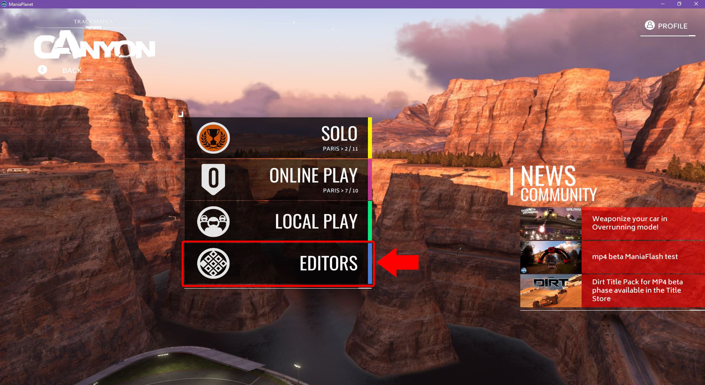
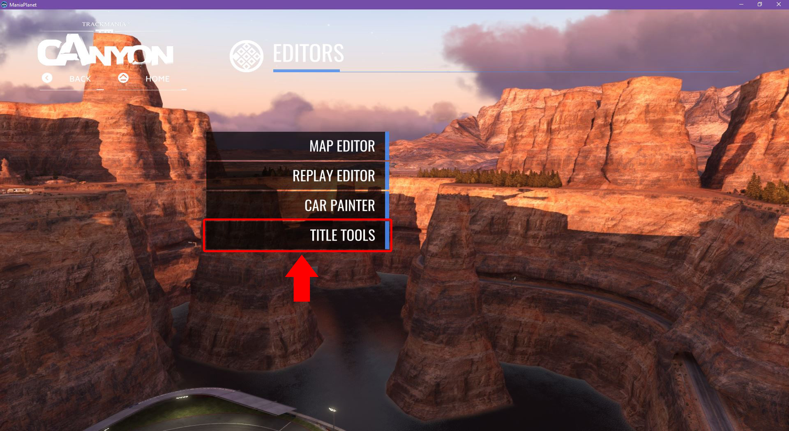
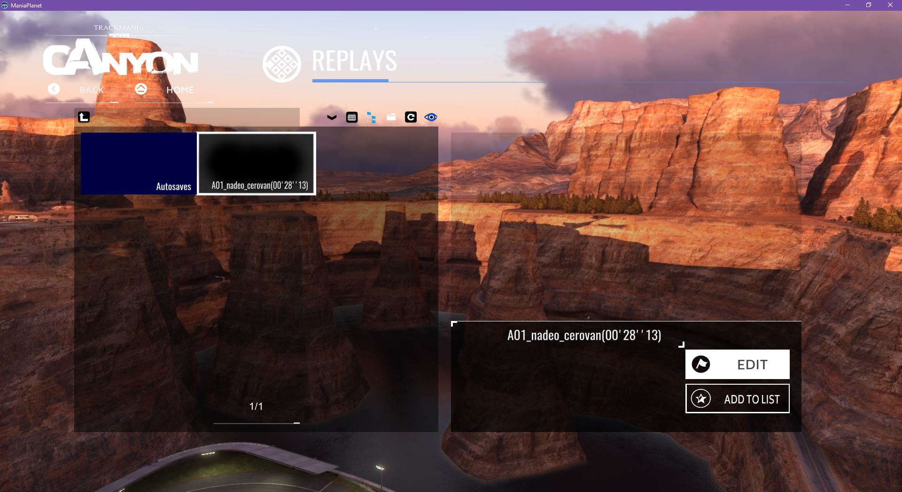
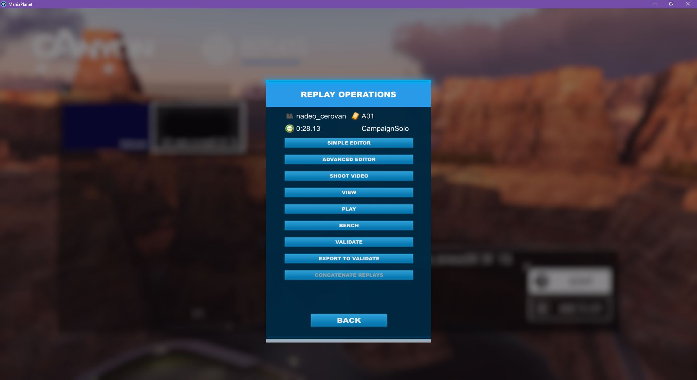

!!! Tutorial from ***xrayjay*** from [this address](http://www.maniapark.com/forum/viewtopic.php?f=87&t=19101)

TM² arrives with an massive screenshot render engine which makes it possible to render very nice screens.
I will show you how to use this tool.

First of all, you have to drive on a track where you like to make an screenshot. Save the replay and go back to the main menu.

You also have to check your game graphics settings, example configuration screenshots are shown at the bottom of this tutorial.

>>>>> It´s important that the track you drive for the screenshots is rendered with High or Ultra Quality shadows!

You can however get premade replays for screenshots [from here](http://www.maniapark.com/forum/viewtopic.php?p=177724#p177724).

Hit the `Editors` button in the menu

Choose `Title Tools`:

Choose `Replay Editor`:

You reach the replay menu, choose here the folder you like (in our case the folder "Replays\" but you can also choose an autosave replay)

Choose the replay which we have saved in the first step and hit `Edit`.

Choose in the menu which appears `Advanced Editor`

Now we are in the editor, here you can choose the skin/model.
1. Click on your players name (click it once that it´s marked, the white line next to your name)
2. Click on the 3 little points to select the skin/model (the menu for the selection appears)
3. Choose your skin/model and hit `Ok`

a. Move the red line (time marker) to the point of the track where you would like to make the screenshot

b. Click on the little cam symbol (free cam)
Now you can move the cam free in your replay, use the mouse (hold the right mouse button to move) and the arrow keys to find your car and set your car in the middle of the screen. You can also adjust the zoom by using the mouse scroll wheel and move the cam up an down by hitting the buttons `Page up` and `Page down` on your keyboard. If the cam is not exactly enough in the movement, hit the `-` key on your number block a few times, the `+` will make the cam faster in it´s movement. While holding the `ctrl` key and the right mouse button and move the mouse you can adjust the vertical rotation of the cam. Test a bit around that your car will stay almost in the middle of your screen and choose an angle where you can see most of the skin/model.

c. The screenshot tool, just hit this little `jpg` icon and the following menu appears:

Hit in this menu `Extended settings` and the settings panel will pop out on the right side.

In the screenshot render menu you can make your selections, test a bit around with all these tools. Generally it´s better to set the `Antialiasing` to the highest level which is possible, the same for the `ts-samples`. You can try the settings which are shown on the screen here, they are good for nice screens.

If you have made your choices, hit `Ok` to confirm and the render engine will start its work...

Now we are almost done with our work!

The next screen which appears, here you see your screenshot rendering with the selections which we have made before.

>>>>> If you have made some selections with high render time it can takes some minutes (!!)

You see a little render time calculation in the screen where you made the render selections (at the bottom of the render selection menu, in my case it takes ~20 seconds to render the screenshot)

The screenshot is done!

if you are satisfied with your settings and the look just hit any key, f.e. the *space* button on your keyboard and the screenshot will be saved to the `...\UserData\ScreenShots` folder.
You can also abort the save process by hitting the `Escape` button on your keyboard.

**That's it, your screen is ready \o/**
